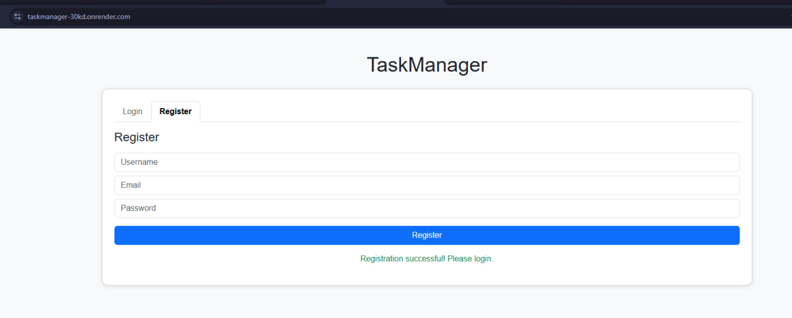
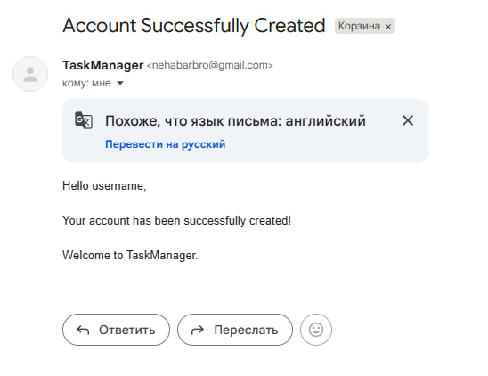
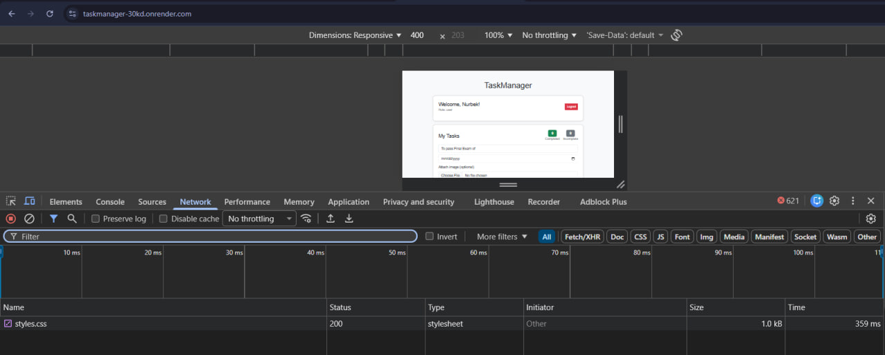
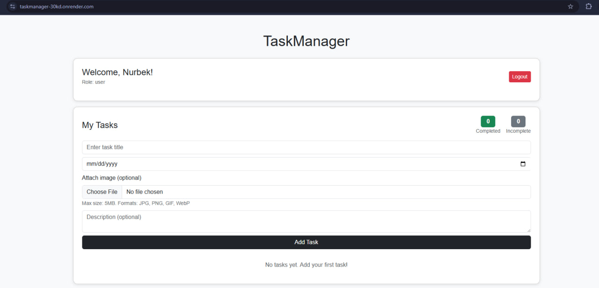
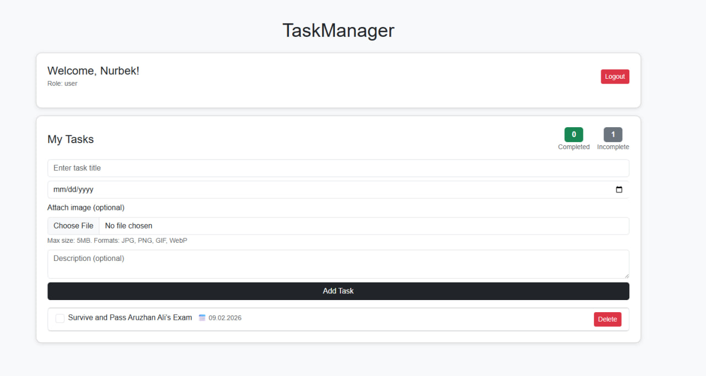
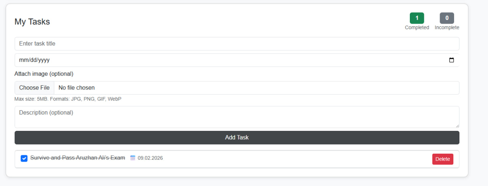
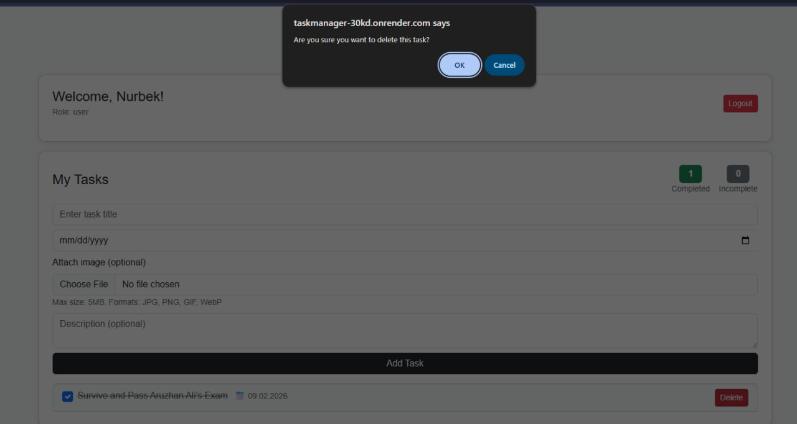
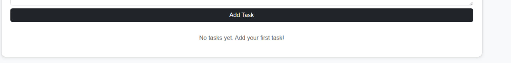

# TaskManager

## Project Overview

TaskManager is a backend-focused task management application developed as a final project.  
The system provides user authentication, task management, email notifications, and a deployed working application.

The project demonstrates core backend concepts including authentication, database integration, RESTful API design, and deployment.

---

## Team

This is a **group project** developed by:

- Rakhat Shomanov
- Nurbek Yerbulekov
- Abilkhaiyr Sarsenbay

---

## Live Demo (Deployment)

The project is deployed and available by link:  
https://taskmanager-30kd.onrender.com/

---

## Tech Stack

- Node.js
- Express.js
- MongoDB (Mongoose)
- JWT Authentication
- bcrypt
- Nodemailer
- HTML / CSS / JavaScript (simple frontend for demonstration)

---

## Project Structure

```
backEndFinalProject/
│
├── config/               # Database and multer configuration
│   ├── db.js
│   └── multer.js
│
├── controllers/          # Application logic
│   ├── authController.js
│   ├── taskController.js
│   └── userController.js
│
├── middleware/           # Auth, role, and error middleware
│   ├── authMiddleware.js
│   ├── errorMiddleware.js
│   ├── roleMiddleware.js
│   └── validationMiddleware.js
│
├── models/               # Mongoose models
│   ├── Task.js
│   └── User.js
│
├── routes/               # API routes
│   ├── authRoutes.js
│   ├── taskRoutes.js
│   └── userRoutes.js
│
├── screenshots/          # Project screenshots
│
├── uploads/              # Uploaded task images
│
├── utils/                # Utility functions (email)
│   └── sendEmail.js
│
├── validators/           # Request validation schemas
│   ├── authValidator.js
│   ├── taskValidator.js
│   └── userValidator.js
│
├── app.js                # Express app setup
├── server.js             # Server entry point
├── index.html            # Frontend interface
├── script.js             # Frontend JavaScript
├── styles.css            # Frontend styles
├── package.json          # Dependencies and scripts
└── README.md             # Project documentation
```

---

## Database

MongoDB is used as the database.

### Collections

**User**

- username
- email
- password (hashed)
- role

**Task**

- title
- description (optional)
- dueDate
- completed
- image (optional)
- user (reference to User)

---

## Authentication & Security

- User registration and login implemented
- Passwords are hashed using bcrypt
- Authentication is handled using JWT
- Private routes are protected via middleware
- Role information is stored for users

---

## Email Notifications

- Email notifications are implemented using Nodemailer
- An email is sent **only after successful user registration**
- SMTP configuration is handled via environment variables

---

## API Functionality

The application provides a RESTful API with the following endpoints:

### Authentication Routes (`/api/auth`)

#### Register User
- **Endpoint:** `POST /api/auth/register`
- **Description:** Register a new user account
- **Access:** Public
- **Request Body:**
  ```json
  {
    "username": "string",
    "email": "string",
    "password": "string"
  }
  ```
- **Response:** Returns JWT token and user data
- **Additional:** Sends welcome email notification upon successful registration

#### Login User
- **Endpoint:** `POST /api/auth/login`
- **Description:** Authenticate user and receive JWT token
- **Access:** Public
- **Request Body:**
  ```json
  {
    "email": "string",
    "password": "string"
  }
  ```
- **Response:** Returns JWT token and user information

---

### Task Management Routes (`/api/tasks`)

#### Create Task
- **Endpoint:** `POST /api/tasks`
- **Description:** Create a new task
- **Access:** Private (requires authentication)
- **Request Body:**
  ```json
  {
    "title": "string",
    "description": "string (optional)",
    "dueDate": "date",
    "image": "file (optional)"
  }
  ```
- **Response:** Returns created task object
- **Note:** Supports image upload via multipart/form-data

#### Get User Tasks
- **Endpoint:** `GET /api/tasks`
- **Description:** Retrieve all tasks belonging to the authenticated user
- **Access:** Private (requires authentication)
- **Response:** Returns array of user's tasks

#### Get All Tasks (Admin)
- **Endpoint:** `GET /api/tasks/all`
- **Description:** Retrieve all tasks from all users
- **Access:** Private (requires admin role)
- **Response:** Returns array of all tasks in the system

#### Get Single Task
- **Endpoint:** `GET /api/tasks/:id`
- **Description:** Retrieve a specific task by ID
- **Access:** Private (requires authentication, owner only)
- **Parameters:** `id` - Task ID
- **Response:** Returns single task object

#### Update Task
- **Endpoint:** `PUT /api/tasks/:id`
- **Description:** Update task details
- **Access:** Private (requires authentication, owner only)
- **Parameters:** `id` - Task ID
- **Request Body:**
  ```json
  {
    "title": "string (optional)",
    "description": "string (optional)",
    "dueDate": "date (optional)",
    "completed": "boolean (optional)"
  }
  ```
- **Response:** Returns updated task object

#### Toggle Task Status
- **Endpoint:** `PATCH /api/tasks/:id/toggle-status`
- **Description:** Toggle task completion status
- **Access:** Private (requires authentication, owner only)
- **Parameters:** `id` - Task ID
- **Response:** Returns task with updated status

#### Delete Task
- **Endpoint:** `DELETE /api/tasks/:id`
- **Description:** Delete a task
- **Access:** Private (requires authentication, owner only)
- **Parameters:** `id` - Task ID
- **Response:** Success message

---

### User Management Routes (`/api/users`)

#### Get User Profile
- **Endpoint:** `GET /api/users/profile`
- **Description:** Get authenticated user's profile information
- **Access:** Private (requires authentication)
- **Response:** Returns user profile data

#### Update User Profile
- **Endpoint:** `PUT /api/users/profile`
- **Description:** Update user's own profile information
- **Access:** Private (requires authentication)
- **Request Body:**
  ```json
  {
    "username": "string (optional)",
    "email": "string (optional)"
  }
  ```
- **Response:** Returns updated user profile

#### Get All Users (Admin)
- **Endpoint:** `GET /api/users`
- **Description:** Retrieve list of all registered users
- **Access:** Private (requires admin role)
- **Response:** Returns array of all users

#### Update User Role (Admin)
- **Endpoint:** `PUT /api/users/role`
- **Description:** Update a user's role (e.g., promote to admin)
- **Access:** Private (requires admin role)
- **Request Body:**
  ```json
  {
    "userId": "string",
    "role": "string"
  }
  ```
- **Response:** Returns updated user data

#### Delete User (Admin)
- **Endpoint:** `DELETE /api/users/:id`
- **Description:** Delete a user account
- **Access:** Private (requires admin role)
- **Parameters:** `id` - User ID
- **Response:** Success message

---

### Authorization & Middleware

- **Authentication:** All private routes require a valid JWT token in the Authorization header: `Bearer <token>`
- **Role-Based Access:** Admin-only routes verify user role through middleware
- **Validation:** Request bodies are validated using Joi schemas
- **Error Handling:** Centralized error handling middleware for consistent responses
- **File Upload:** Image uploads handled via Multer middleware (for task images)

### Security Features

- Password hashing with bcrypt
- JWT token-based authentication
- Role-based authorization (user/admin)
- Input validation and sanitization
- Protected routes with middleware
- User can only access and modify their own tasks (except admins)

---

## Environment Variables

The project uses a `.env` file with the following variables:

PORT
MONGO_URI
JWT_SECRET
SMTP_HOST
SMTP_PORT
SMTP_USER
SMTP_PASS

---

## Setup Instructions (Local)

1. Clone the repository:

git clone <repository-url>

2. Install dependencies:

npm install

3. Create a `.env` file and configure environment variables

4. Run the project:

npm run dev

---

## Screenshots

Below are screenshots demonstrating the main features of the application.

## Screenshots

### User Registration




### Registration Email



### Login




### Create Task



### Update Task



### Delete Task




### User Registration

Registration form and successful registration message.

### Registration Email

Email notification confirming successful account creation.

### Login

User login interface.

### Task Creation

Creating a new task with optional description and image.

### Task Update

Updating task completion status.

### Task Deletion

Deleting a task with confirmation dialog.

---

